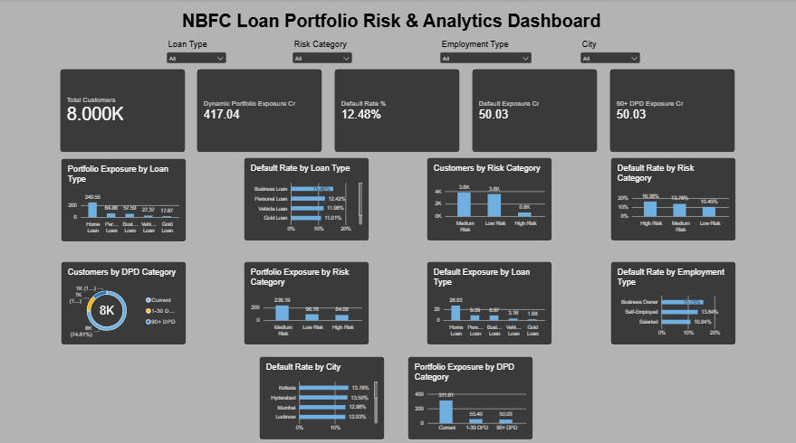
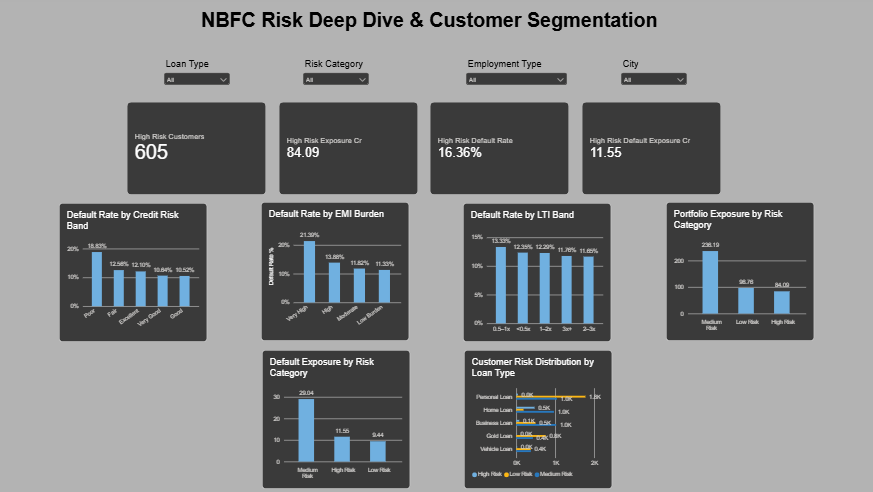

**# NBFC Loan Portfolio Risk & Analytics**

**## Project Overview**

This project analyzes an NBFC loan portfolio to identify credit risk, affordability risk, delinquency patterns, portfolio concentration, and default exposure.

The project follows an end-to-end analytics workflow using **\*\*Python, SQL, Machine Learning, FastAPI, SQLite, Streamlit, and Power BI\*\***.

\---

**## Business Problem**

NBFCs need to continuously monitor their loan portfolio to identify customers and segments that may create higher credit losses.

This project focuses on answering key business questions:

\- Which loan products have higher default risk?

\- How does credit score relate to default rates?

\- Which customers have higher EMI affordability risk?

\- How does loan-to-income exposure vary across customers?

\- Which employment and city segments show higher risk?

\- How much portfolio exposure is currently in 90+ DPD?

\- Which customer risk segments require closer monitoring?

\- Where is the portfolio most concentrated?

\---

**## Objectives**

1\. Analyze overall portfolio exposure and default performance.

2\. Identify high-risk loan products and customer segments.

3\. Analyze credit score, EMI burden, and loan-to-income risk.

4\. Study delinquency using Days Past Due (DPD).

5\. Build a rule-based customer risk segmentation model.

6\. Build Logistic Regression and Random Forest default prediction models.

7\. Evaluate models using ROC-AUC, precision, recall, confusion matrix, and feature importance.

8\. Store the ML-enriched portfolio in SQLite and expose analytics through FastAPI.

9\. Develop an interactive Streamlit risk dashboard in addition to the existing Power BI dashboard.

10\. Support collections prioritization using DPD, exposure, credit score, and ML probability.

\---

\## Dataset

The project uses a synthetic NBFC loan portfolio containing:

\- \*\*8,000\*\* loan/customer records

\- Customer demographics

\- Employment information

\- Monthly income

\- Credit score

\- Loan amount

\- Loan type

\- Tenure

\- Interest rate

\- EMI

\- Days Past Due (DPD)

\- Default flag

\- Application date

\---

\## Tools & Technologies

\- Python

\- Pandas

\- NumPy

\- Matplotlib

\- scikit-learn

\- Logistic Regression

\- Random Forest

\- SQLite

\- MySQL

\- FastAPI

\- Uvicorn

\- Streamlit

\- Power BI

\- JupyterLab

\- Git & GitHub
- Joblib / persisted ML pipeline
- Swagger / OpenAPI

\---

\## Project Workflow

\`\`\`text

Synthetic Dataset

       ↓

Data Quality Validation

       ↓

Feature Engineering

       ↓

Portfolio KPI Analysis

       ↓

Rule-Based Risk Scoring

       ↓

Machine Learning

   ├── Logistic Regression

   └── Random Forest

       ↓

Model Evaluation

   ├── ROC-AUC

   ├── Precision / Recall

   ├── Confusion Matrix

   └── Feature Importance

       ↓

SQLite Database

       ↓

FastAPI REST API

       ↓ HTTP

Streamlit Dashboard

       ↓

Collections & Portfolio Risk Insights

       ↓

Power BI Analytical Dashboard

\`\`\`

\---

\## Portfolio KPIs

\| KPI | Value |

\|---|---:|

\| Total Customers | 8,000 |

\| Total Portfolio Exposure | ₹417.04 Cr |

\| Average Loan Amount | ₹5.21 Lakh |

\| Average Monthly Income | ₹56,390 |

\| Average EMI | ₹12,541 |

\| Total Defaults | 998 |

\| Default Rate | 12.47% |

\| Default Exposure | ₹50.03 Cr |

\| 90+ DPD Exposure | ₹50.03 Cr |

\| High-Risk Customers | 605 |

\| High-Risk Exposure | ₹84.09 Cr |

\| High-Risk Default Rate | 16.36% |

\| High-Risk Default Exposure | ₹11.55 Cr |

\---

\## Risk Analysis

\### 1. Loan Product Risk

The portfolio was analyzed across:

\- Personal Loan

\- Home Loan

\- Business Loan

\- Vehicle Loan

\- Gold Loan

Business Loans showed the highest observed default rate among the loan products at approximately \*\*15.46%\*\*.

Home Loans represented the largest share of total portfolio exposure.

\### 2. Credit Risk

Customers were grouped into:

\- Poor

\- Fair

\- Good

\- Very Good

\- Excellent

The analysis compares customer volume, exposure, defaults, default rate, and default exposure across credit risk bands.

\### 3. EMI Burden

Customers were segmented using the EMI-to-income ratio:

\- Low Burden

\- Moderate

\- High

\- Very High

The \*\*Very High EMI Burden\*\* segment showed the highest observed default rate.

\### 4. Loan-to-Income Analysis

Loan-to-annual-income ratios were grouped into:

\- <0.5x

\- 0.5–1x

\- 1–2x

\- 2–3x

\- 3x+

This analysis helps identify customers with relatively high loan exposure compared with annual income.

\### 5. Employment Risk

The portfolio was analyzed across:

\- Salaried

\- Self-employed

\- Business Owner

Business Owners showed the highest observed default rate among the employment segments.

\### 6. Geographic Risk

Default rates and portfolio exposure were compared across major cities including:

\- Mumbai

\- Delhi

\- Bengaluru

\- Hyderabad

\- Chennai

\- Pune

\- Ahmedabad

\- Jaipur

\- Kolkata

\- Lucknow

\### 7. Delinquency / DPD Analysis

Customers were categorized using Days Past Due:

\- Current

\- 1–30 DPD

\- 31–60 DPD

\- 61–89 DPD

\- 90+ DPD

The portfolio contains approximately \*\*₹50.03 Cr\*\* of exposure in the 90+ DPD category.

\---

\## Customer Risk Scoring

A rule-based risk score was developed using three dimensions.

\### Credit Risk — 40 Points

Based on credit score.

\### EMI Burden — 35 Points

Based on EMI-to-income ratio.

\### Loan-to-Income — 25 Points

Based on loan amount relative to annual income.

\### Total Risk Score

\`\`\`text

Risk Score = Credit Risk Score

           + EMI Risk Score

           + LTI Risk Score

\`\`\`

Customers were classified into:

\`\`\`text

0–33   → Low Risk

34–66  → Medium Risk

67–100 → High Risk

\`\`\`

\### Risk Segment Results

\| Risk Category | Customers | Default Rate | Exposure |

\|---|---:|---:|---:|

\| Low Risk | 3,571 | 10.45% | ₹96.76 Cr |

\| Medium Risk | 3,824 | 13.76% | ₹236.19 Cr |

\| High Risk | 605 | 16.36% | ₹84.09 Cr |

\---

\## Machine Learning Default Prediction

Two classification models were implemented:

\- Logistic Regression

\- Random Forest

The ML feature set uses borrower, loan, employment, geographic, affordability, and exposure-related variables.

\`days_past_due\` is excluded from the predictive feature set to avoid using a post-disbursement delinquency indicator as a predictor of default.

\### Model Results

\| Model | ROC-AUC |

\|---|---:|

\| Logistic Regression | 0.583 |

\| Random Forest | 0.590 |

Random Forest test-set metrics:

\- Precision for default class: \*\*0.185\*\*

\- Recall for default class: \*\*0.345\*\*

These results represent a baseline model evaluated on synthetic data rather than a production credit model.

\### Top ML Features

\| Feature | Importance |

\|---|---:|

\| Credit Score | 0.1815 |

\| EMI-to-Income | 0.1450 |

\| Interest Rate | 0.1073 |

\| Loan Amount | 0.1049 |

\| Loan-to-Annual-Income | 0.0982 |

\| Monthly Income | 0.0978 |

\| Age | 0.0706 |

\| Tenure Months | 0.0407 |

\| Employment Type — Salaried | 0.0372 |

\| Employment Type — Business Owner | 0.0194 |

Feature importance indicates model contribution and should not be interpreted as causality.

### Saved Model Pipeline

The trained Random Forest preprocessing/model pipeline is persisted for application use:

```text
models/rf_risk_pipeline.joblib
```

This allows the application/backend workflow to reuse the trained pipeline without retraining the model for every request.

\---

\## SQLite & FastAPI Analytics Layer

SQLite is used as the application database containing the ML-enriched loan portfolio.

FastAPI exposes both portfolio analytics and application workflows as REST endpoints.

### Portfolio Analytics

```text
GET  /api/portfolio/summary
GET  /api/portfolio/product-risk
GET  /api/portfolio/credit-risk
GET  /api/portfolio/city-risk
GET  /api/portfolio/vintage
GET  /api/risk/high-risk-loans
GET  /api/collections/priority
```

### Loan Application Workflows

```text
POST /api/loans
POST /api/pipeline/simulate-new-loans
```

Portfolio endpoints support filters for:

- Product
- City
- Credit Band

The API layer connects the SQLite database and application logic to the Streamlit frontend over HTTP/JSON.

### Interactive API Documentation

When FastAPI is running:

```text
http://127.0.0.1:8000/docs
```

The Swagger/OpenAPI interface can be used to inspect and test the available endpoints.

---

\## Streamlit Dashboard

The Streamlit application is the primary interactive frontend for the project. The current UI uses a **professional dark fintech/SaaS-style interface** and communicates with FastAPI over HTTP/JSON.

The current UI uses a professional dark fintech/SaaS-style design and communicates with FastAPI over HTTP/JSON.

### Application Pages

1. **Overview**
   - Portfolio KPIs
   - Product risk
   - Credit-band risk
   - City risk

2. **Loan Origination**
   - Enter a new loan/application
   - Submit the loan to FastAPI
   - Demonstrate an API-driven lending workflow

3. **Portfolio Risk**
   - Product risk
   - Credit risk
   - Geographic risk
   - Filtered portfolio analytics

4. **ML Risk**
   - Model metrics
   - Confusion matrix
   - Feature importance
   - High-risk loan analysis

5. **Vintage**
   - Quarterly cohort analysis
   - Exposure and default trends

6. **Collections**
   - Overdue-loan prioritization
   - DPD
   - Exposure
   - Credit score
   - EMI-to-income
   - ML default probability

7. **Loan Simulator**
   - Simulate new-loan scenarios
   - Test new-loan portfolio inputs
   - Send simulation requests through the FastAPI pipeline

8. **About**
   - Project overview
   - Technology stack
   - Architecture
   - Project information

### Frontend ↔ Backend Flow

```text
User
  ↓
Streamlit Frontend
  ↓ HTTP / JSON
FastAPI Backend
  ↓
SQLite + ML Outputs
  ↓
Analytics / Application Response
  ↓
Streamlit Visualization
```

---

\## Loan Origination & New-Loan Simulation

The application now supports two API-driven lending workflows in addition to historical portfolio analytics.

### 1. Loan Origination

The **Loan Origination** page accepts a new loan/application and sends it to the FastAPI backend:

```text
Streamlit
   ↓
POST /api/loans
   ↓
FastAPI
   ↓
Loan Application Workflow
```

This demonstrates how the analytics platform can support an application-side lending workflow rather than only reporting historical data.

### 2. New-Loan Simulator

The **Loan Simulator** page provides a controlled workflow for testing simulated new-loan scenarios:

```text
Streamlit
   ↓
POST /api/pipeline/simulate-new-loans
   ↓
FastAPI Pipeline
   ↓
Simulated Loan Processing
   ↓
Portfolio / Risk Workflow
```

These workflows demonstrate the transition from static analytics to an **API-driven lending analytics application**.

---

## Collections Priority

The collections module focuses on active overdue loans with \*\*1–89 DPD\*\*.

Displayed indicators include:

\- Customer ID

\- Product

\- City

\- Loan Amount

\- DPD

\- Credit Score

\- EMI-to-Income

\- ML Default Probability

Operational ordering is based on:

\`\`\`text

Higher DPD

↓

Higher Loan Amount

↓

Lower Credit Score

\`\`\`

ML default probability is displayed as an additional predictive risk signal.

\---

\## SQL Analysis

MySQL was used for:

\- Data validation

\- Portfolio KPI calculations

\- Product risk analysis

\- Credit risk analysis

\- EMI burden analysis

\- Employment risk analysis

\- City risk analysis

\- DPD analysis

\- Customer risk segmentation

\- Portfolio concentration analysis

\- Risk priority analysis

\- KPI reconciliation

Reusable SQL views were created for:

\- Customer Risk Scores

\- Portfolio KPIs

\- Product Risk Summary

\- Employment Risk Summary

\- DPD Risk Summary

\- City Risk Summary

\---

\## 📊 Power BI Dashboard & Business Intelligence

Power BI is a **completed analytical layer of this project**, built for executive portfolio monitoring, risk analysis, segmentation, and business decision support.

The project contains a dedicated Power BI report:

```text
NBFC_Loan_Portfolio_Risk_Analytics.pbix
```

The Power BI dashboard is complementary to the Streamlit application:

```text
Power BI
→ Executive BI reporting
→ Interactive portfolio analysis
→ Risk segmentation
→ Exposure / default monitoring

Streamlit
→ API-driven application
→ Operational risk views
→ ML risk
→ Collections
→ Loan Origination
→ Loan Simulation
```

### Power BI Dashboard Structure

The completed Power BI report contains **2 analytical pages**.

---

### 📈 Page 1 — Executive Portfolio Overview

This page provides an executive-level view of the overall NBFC portfolio.

#### KPI Cards

The dashboard includes:

- **Total Customers**
- **Total Portfolio Exposure**
- **Default Rate**
- **Default Exposure**
- **90+ DPD Exposure**

#### Portfolio & Risk Visualizations

The page includes:

- **Exposure by Loan Type**
- **Default Rate by Loan Type**
- **Customer Risk Distribution**
- **DPD Analysis**
- **Employment Risk**
- **City Risk**

These visuals allow portfolio performance and risk concentration to be reviewed from multiple business dimensions.

#### Interactive Slicers

The executive page includes slicers for:

- **Loan Type**
- **Risk Category**
- **Employment Type**
- **City**

This allows the portfolio to be dynamically filtered for segment-level analysis.

---

### 🔎 Page 2 — Risk Deep Dive & Customer Segmentation

The second page focuses on borrower-level risk drivers and customer segmentation.

#### Risk Analysis

The page includes:

- **Credit Risk Analysis**
- **EMI Burden Analysis**
- **Loan-to-Income Analysis**
- **Risk Category Exposure**
- **Default Exposure by Risk Category**
- **Customer Risk Distribution by Loan Type**

This page connects borrower affordability and exposure indicators with the project's rule-based risk segmentation.

---

### 🖼️ Power BI Dashboard Preview

#### Page 1 — Executive Portfolio Overview



#### Page 2 — Risk Deep Dive & Customer Segmentation



---

### 💼 Business Intelligence Layer

The Power BI implementation demonstrates how the same loan-level dataset can be transformed into an executive-facing BI product.

```text
Loan Portfolio Data
        ↓
Data Preparation / SQL Analysis
        ↓
Portfolio & Risk Metrics
        ↓
Power BI Data Model
        ↓
Interactive Visualizations
        ↓
Executive Portfolio Monitoring
```

The BI layer supports analysis of:

- Portfolio size and exposure
- Default performance
- Product concentration
- Credit-risk segmentation
- EMI affordability
- Loan-to-income exposure
- Delinquency / DPD
- Employment segments
- Geographic segments
- Risk-category exposure
- Default exposure

Power BI is therefore part of the **completed project**, not just a future enhancement.

---

\## Data Quality Validation

The final dataset passed the following checks:

\- \*\*8,000\*\* total records

\- \*\*8,000\*\* unique customers

\- \*\*0\*\* missing values

\- \*\*0\*\* duplicate customer IDs

\- \*\*0\*\* invalid default/DPD records

\- \*\*0\*\* unaffordable loans

\- \*\*0\*\* high EMI burden records above 50%

\---

\## Key Business Insights

\- The portfolio has \*\*₹417.04 Cr\*\* of total exposure.

\- The observed default rate is \*\*12.47%\*\*.

\- \*\*₹50.03 Cr\*\* of exposure is associated with 90+ DPD.

\- Business Loans have the highest observed default rate among loan products.

\- Home Loans account for the largest share of portfolio exposure.

\- Very High EMI Burden customers show elevated default rates.

\- High-risk customers represent \*\*605 customers\*\* with \*\*₹84.09 Cr\*\* exposure.

\- High-risk customers have a \*\*16.36%\*\* default rate.

\- Medium-risk customers represent the largest exposure among the three risk segments.

\---

\## System Architecture

\`\`\`text

                 8,000 Loan Records

                         |

                         v

              Python Processing

                         |

                         v

              Feature Engineering

                         |

             +-----------+-----------+

             |                       |

             v                       v

      Rule-Based Risk          ML Prediction

          Scoring              Logistic Regression

                               Random Forest

             |                       |

             +-----------+-----------+

                         |

                         v

                  Model Evaluation

                         |

                         v

                  SQLite Database

                         |

                         v

                    FastAPI API

                         |

                      HTTP/REST

                         |

                         v

                 Streamlit Dashboard

                         |

                         v

              Portfolio Risk Analytics

\`\`\`

\---

\## 🔗 Project Links

### GitHub Repository

[**NBFC Loan Portfolio & Credit Risk Analytics**](https://github.com/Khushi23-sol/NBFC-Loan-Portfolio-Risk-Analytics)

The repository contains the complete source code, notebook, SQL analysis, Power BI report, ML outputs, SQLite database, FastAPI backend, Streamlit application, and documentation.

### Streamlit Application

Run the interactive application locally at:

```text
http://localhost:8501
```

Start it with:

```powershell
python -m streamlit run app.py
```

The application includes:

- Portfolio Overview
- Loan Origination
- Portfolio Risk
- ML Risk
- Vintage Analysis
- Collections
- Loan Simulator
- About

### FastAPI Backend

Run the backend locally at:

```text
http://127.0.0.1:8000
```

Interactive Swagger/OpenAPI documentation:

```text
http://127.0.0.1:8000/docs
```

Start it with:

```powershell
python -m uvicorn api:app --reload
```

> The project currently documents local application endpoints; no public deployment URL is claimed.

---

## Project Structure

\`\`\`text

NBFC PROJECT/

│

├── Data/

│   ├── loan_portfolio.csv

│   ├── loan_portfolio_with_ml.csv

│   ├── ml_model_metrics.csv

│   ├── ml_confusion_matrix.csv

│   ├── ml_feature_importance.csv

│   └── nbfc_risk_analytics.db

│

├── Notebooks/

│   └── NBFC_Loan_Portfolio_Risk_Analytics.ipynb

│

├── SQL/

│   ├── nbfc_risk_analysis.sql

│   ├── sql_additions.sql

│   └── sqlite_risk_analysis.sql

│

├── Screenshots/

│   ├── dashboard_page_1.png

│   └── dashboard_page_2.png

│

├── generate_data.py

├── ml_risk_model.py

├── ml_evaluation.py

├── live_loan_simulator.py
├── build_sqlite.py

├── api.py

├── app.py

├── generate_executive_summary.py

├── EXECUTIVE_SUMMARY.md

├── NBFC_Loan_Portfolio_Risk_Analytics.pbix

├── README.md

└── .gitignore

\`\`\`

\---

\## How to Run

\### 1. Open the project

\`\`\`powershell

cd "C:\Users\KHUSHI\Documents\NBFC PROJECT"

\`\`\`

\### 2. Run the ML pipeline

\`\`\`powershell

python ml_risk_model.py

\`\`\`

This creates the ML-enriched loan dataset.

\### 3. Run ML evaluation

\`\`\`powershell

python ml_evaluation.py

\`\`\`

This generates:

\- \`Data/ml_model_metrics.csv\`

\- \`Data/ml_confusion_matrix.csv\`

\- \`Data/ml_feature_importance.csv\`

\### 4. Build the SQLite database

\`\`\`powershell

python build_sqlite.py

\`\`\`

\### 5. Start FastAPI

\`\`\`powershell

python -m uvicorn api\:app --reload

\`\`\`

FastAPI runs at:

\`\`\`text

http\://127.0.0.1:8000

\`\`\`

\### 6. Start Streamlit

Open another PowerShell window:

\`\`\`powershell

cd "C:\Users\KHUSHI\Documents\NBFC PROJECT"

python -m streamlit run app.py

\`\`\`

Streamlit runs at:

\`\`\`text

http\://localhost:8501

\`\`\`

Both FastAPI and Streamlit should be running for the complete application.

\### 7. Existing Notebook / MySQL / Power BI

The original notebook, MySQL SQL analysis, and Power BI dashboard are retained as part of the project.

\---

\## Limitations

This project uses a synthetic loan portfolio for analytical and demonstration purposes.

\- ML performance should not be interpreted as production credit-model performance.

\- Feature importance indicates model contribution, not causality.

\- Rule-based thresholds are predefined analytical rules.

\- Default predictions require validation on real historical lending data before real-world use.

\- Production deployment would require model validation, calibration, monitoring, explainability, governance, and appropriate credit-risk controls.

\---

\## Future Scope

\- Model calibration and threshold optimization

\- Hyperparameter tuning and cross-validation

\- Explainable AI using SHAP

\- Probability of Default calibration

\- Loss Given Default and Expected Loss modelling

\- Automated high-risk alerts

\- Authentication and role-based API access

\- Cloud deployment

\- Live loan-servicing data integration

\- Model monitoring and drift detection

\---

\## Project Outcome

The project demonstrates an end-to-end financial risk analytics workflow combining:

\*\*Python → ML → SQLite/SQL → FastAPI → Streamlit → Power BI\*\*

It converts raw loan-level data into portfolio KPIs, risk segments, delinquency analysis, ML risk predictions, collections priorities, API-driven loan workflows, new-loan simulations, and a **completed Power BI business intelligence dashboard** for executive and risk analysis.

\---

\## Author

**Khushi Solanki**

B.Tech Mechanical Engineering  
Honors in Robotics  
DJSCE, Mumbai

[**GitHub Repository → NBFC Loan Portfolio & Credit Risk Analytics**](https://github.com/Khushi23-sol/NBFC-Loan-Portfolio-Risk-Analytics)
